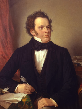
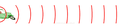

# Test Images

These are all public domain test images (pictures of old composers mostly), in `jpg`, `png`, and `gif` formats.

In particular:

-  and  are the exact same binary (image);
  -  is the correct output of `transai.utils.images.ResizeImageForVision(open('100.jpg', 'rb').read(), max_pixels=128)`
-  and  are the same image, re-scaled (`108.jpg` is the smaller one);
-  is a long-ish animated GIF.
  -  to  are the correct 11 frames returned by `transai.utils.images.AnimationFrames(open('109.gif', 'rb').read(), max_pixels=128, decimation=True)`
